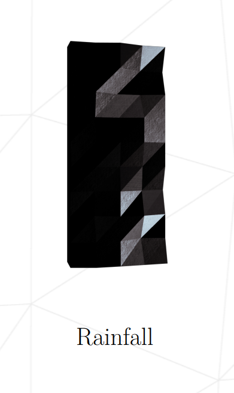

# rainfall

## 2e Projet cybersecurite - Ecole 42

Le projet consiste a exploiter un .iso dans une VM.
Trouver une faille dans un programme pour augmenter ses droits et afficher le mot de passe, permettant de se connecter a l'utilisateur suivant.

